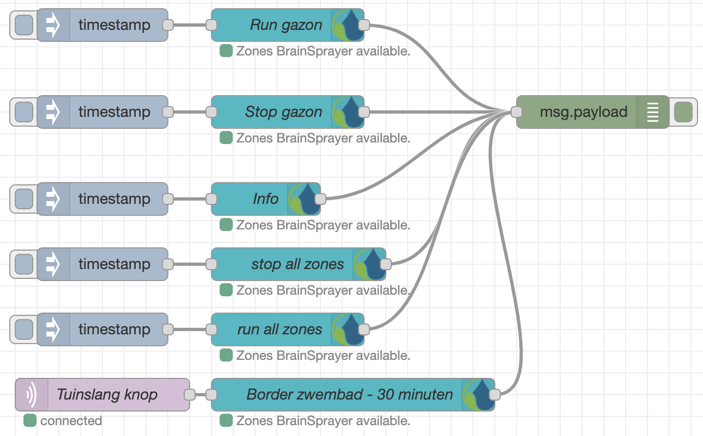

# node-red-contrib-hydrawise

Building Automation and Control Networks Protocol toolbox for Node-RED.

## Install

Run command on Node-RED installation directory.

	npm install node-red-contrib-hydrawise 

or run command for global installation.

	npm install -g node-red-contrib-hydrawise 

try these options on npm install to build, if you have problems to install

    --unsafe-perm --build-from-source
    

### License

The MIT License with support via [Subscription bundle][3] or GitHub Sponsoring
[Klaus Landsdorf][1] and Community driven work

### Important

This is **not** an official product of the hydrawise Advocacy Group.
It is just to provide hydrawise to Node-RED based on node-bacstack package.
hydrawise® is a registered trademark of American Society of Heating, Refrigerating and Air-Conditioning Engineers (ASHRAE). 

### Contribution NodeJS hydrawise® Library

I'd like to give special thanks to [Fabio Huser][2] and [Apollon77][4]. 

[1]:https://github.com/sponsors/biancode
[2]:https://github.com/fh1ch
[3]:https://osi.bianco-royal.com/
[4]:https://github.com/Apollon77